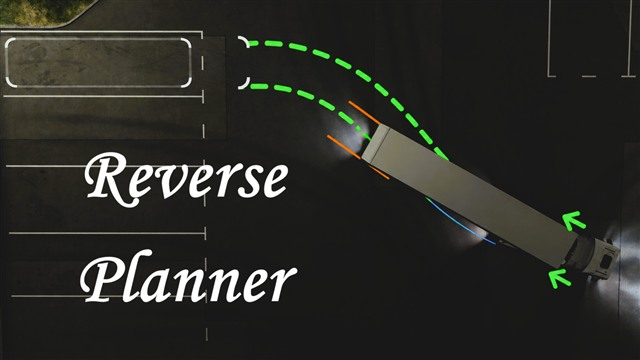

# ReversePlanner

A world-space reverse route planner for **Euro Truck Simulator 2 1.60.x** on Windows x64.

[Repository folder](https://github.com/yyysheng/ETS2mods/tree/main/mods/ETS2_Reverse_Planner) | [GitHub release v0.1.0-beta](https://github.com/yyysheng/ETS2mods/releases/tag/reverse-planner-v0.1.0-beta) | [Steam Workshop](https://steamcommunity.com/sharedfiles/filedetails/?id=3800090083)

ReversePlanner identifies the active game-native task parking frame and continuously plans an attached trailer's reverse route. It draws two green tractor-tail tracks in the game world and gives steering instructions with arrows beside the cab. It is a driver aid, not autonomous driving.

## Features

- Guidance from the currently attached trailer to the unique active task parking frame.
- Two complete green tracks following the tractor's rear-left and rear-right corners.
- Solid first 7 m followed by a dashed long-range route.
- Continuously updated cab-side steering arrows; straight, left and right indications use a smooth 1–36 degree range.
- Red X beside the cab only after a route has remained unavailable for one second.
- Vehicle-specific wheelbase, fifth-wheel offset, trailer axle position, lift state and steerable trailer-axle telemetry.
- A 70-degree hard articulation limit and tractor/trailer contour validation.
- Cooperative native hook sidecar compatible with Reverse Posture Assistant v0.10.10.
- No ReShade add-on, camera capture, mirror capture, depth-buffer access or graphics-API proxy DLL.

## Beta limitations

- The current product guides only an attached trailer to a task parking frame. It intentionally stays silent while the tractor is detached.
- General traffic and building perception is incomplete. A displayed route must not be treated as a collision-free guarantee.
- Only verified ETS2 1.60.x executable layouts enable native world rendering. Other builds fail closed and log diagnostics.
- The planner does not control throttle, brakes or steering.

## Installation

### Full standalone package

1. Download `ETS2_Reverse_Planner_v0.1.0-beta_Full.zip` from the GitHub release.
2. Exit ETS2, extract the archive and run `Install-Full.bat`.
3. Enable **ReversePlanner (beta) For 1.60.x** in the ETS2 Mod Manager.

### Steam Workshop package

1. Subscribe to the ReversePlanner Workshop item.
2. Download `ETS2_Reverse_Planner_v0.1.0-beta_Runtime_for_Workshop.zip` from the GitHub release.
3. Exit ETS2, extract it and run `Install-Runtime-Only.bat`.
4. Enable the Workshop item in the Mod Manager.

The Workshop cannot install the required native telemetry DLL into the game directory. A Workshop subscription alone is therefore not sufficient.

## Supported game version

- Euro Truck Simulator 2 `1.60.x` when an exact or enabled-hook-compatible build profile matches
- Verified locally on ETS2 `1.60.1.7`
- Windows x64

## 中文说明

ReversePlanner 是独立的挂车倒车路线规划辅助模组。它锁定当前任务的游戏原生停车框，根据车头、鞍座、挂车轴组和任务框姿态持续规划路线，并在游戏世界中显示两条绿色车尾轨迹以及车头两侧的方向提示箭头。

当前 beta 仅处理“已连接挂车 → 任务停车框”。车头脱离挂车时不会显示路线、箭头或红色 X。它不会自动控制车辆，也不能保证识别全部建筑和交通障碍；驾驶员仍需自行观察环境。

工坊只能安装模型资源，不能把原生遥测 DLL 安装到游戏目录。订阅工坊版本后仍需从 GitHub Release 下载并安装 `Runtime_for_Workshop`；也可以直接使用 `Full` 完整包，但不要同时启用本地包和工坊包。

## Credits

- Project author: [yyysheng](https://github.com/yyysheng)
- Telemetry API: SCS SDK
- Hook library: MinHook

See [THIRD_PARTY_NOTICES.md](THIRD_PARTY_NOTICES.md) for license details. Source build instructions are in [BUILDING.md](BUILDING.md).
