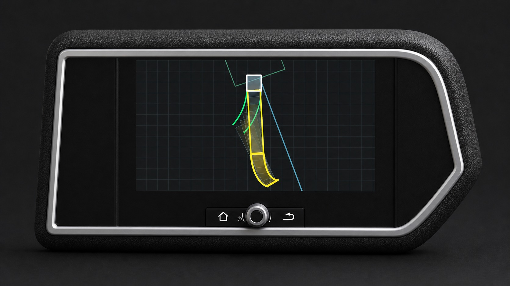

# ETS2 Reverse Posture Assistant

A world-space reverse posture and trajectory assistant for the exact
**Euro Truck Simulator 2 1.60.1.7** Windows x64 build.

[Repository folder](https://github.com/yyysheng/ETS2mods/tree/main/mods/ETS2_Reverse_Posture_Assistant) | [Steam Workshop](https://steamcommunity.com/sharedfiles/filedetails/?id=3767153599) | [GitHub release v0.10.7](https://github.com/yyysheng/ETS2mods/releases/tag/reverse-posture-assistant-v0.10.7) | [Previous v0.6.0 release](https://github.com/yyysheng/ETS2mods/releases/tag/reverse-posture-assistant-v0.6.0)

When reverse gear is selected, the plug-in predicts tractor and trailer posture from official
telemetry and creates collisionless frame models directly in the game world. The frames are normal
Prism3D entities, so every game camera can see the same objects. No camera feed, render pass, depth
buffer, constant buffer, or post-process overlay is read or modified.

## Features

- Live tractor reverse trajectory.
- Trailer articulation and future posture prediction.
- Separate blue tractor and orange trailer swept-area boundaries over a fixed 5 m path.
- Ground-contact-aware virtual axles for liftable and steerable tractor/trailer axles.
- Collisionless low-profile line entities placed on the predicted ground path.
- Automatic display only while reverse gear is selected.
- Visible through normal game rendering from exterior, interior, free, and mirror views.
- Exact executable hash and native signature checks; unsupported builds fail closed.
- No ReShade, `dxgi.dll`, `d3d11.dll`, or graphics API dependency.

## Installation

### Full standalone package

1. Download [`ETS2_Reverse_Posture_Assistant_v0.10.7_Full.zip`](https://github.com/yyysheng/ETS2mods/releases/download/reverse-posture-assistant-v0.10.7/ETS2_Reverse_Posture_Assistant_v0.10.7_Full.zip).
2. Extract it and run `Install-Full.bat`.
3. Enable **ETS2 Reverse Posture Assistant** in the ETS2 Mod Manager.

### Steam Workshop package

1. Subscribe to the [Steam Workshop item](https://steamcommunity.com/sharedfiles/filedetails/?id=3767153599).
2. Download [`ETS2_Reverse_Posture_Assistant_v0.10.7_Runtime_for_Workshop.zip`](https://github.com/yyysheng/ETS2mods/releases/download/reverse-posture-assistant-v0.10.7/ETS2_Reverse_Posture_Assistant_v0.10.7_Runtime_for_Workshop.zip).
3. Extract it and run `Install-Runtime-Only.bat`.

The Workshop cannot install the telemetry plug-in into the game directory, so the GitHub runtime package is required.

### Upgrade from v0.6.0

1. Download `ETS2_Reverse_Posture_Assistant_v0.10.7_Upgrade_from_v0.6.0.zip`.
2. Exit ETS2, extract the package, and run `Upgrade-From-v0.6.0.bat`.
3. The installer backs up and disables the old Reverse Assistant runtime, then installs v0.10.7.

The upgrade does not modify or remove `dxgi.dll`, `d3d11.dll`, or ambiguous shared
libraries. This allows Snowymoon, ReShade, and other graphics mods to keep their own proxy DLL.

## Supported game version

- Euro Truck Simulator 2 `1.60.1.7`
- Windows x64

## 中文说明

**欧卡 2 倒车姿态助手**的新架构严格适用于 Euro Truck Simulator 2 1.60.1.7。挂入倒挡后，它根据官方遥测数据计算未来姿态，并在游戏世界中创建无碰撞的低矮实体框线。

主要特点：

- 实时预测车头和挂车倒车轨迹。
- 蓝色车头扫掠边界与橙色挂车扫掠边界分别显示，固定预测 5 米。
- 根据车轮实际接地和转向状态适配提升桥、随动桥以及不同轴距车型。
- 仅在倒挡时显示，不影响原车娱乐屏。
- 不抓取摄像头、渲染过程、深度或常量缓冲数据。
- 框线是 Prism3D 世界实体，各种正常视角看到的是同一组对象。
- 模型不含 PMC 碰撞文件，不参与车辆碰撞。
- 不安装、不替换也不删除 `dxgi.dll` 或 `d3d11.dll`。

完整安装请下载 Release 中的 `Full` 包；通过 Steam 创意工坊订阅时，还需要安装 `Runtime_for_Workshop`。从 0.6.0 升级请选择 `Upgrade_from_v0.6.0`，它会备份并停用旧版倒车助手运行组件，但保留其他模组可能使用的 `dxgi.dll`。

## Credits

- Project author: [yyysheng](https://github.com/yyysheng)
- Telemetry API: SCS SDK

See [THIRD_PARTY_NOTICES.md](THIRD_PARTY_NOTICES.md) for license details.

Source build instructions are available in [BUILDING.md](BUILDING.md).
